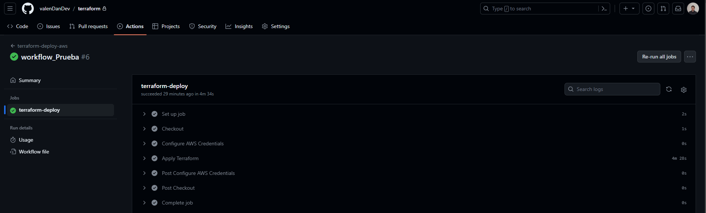
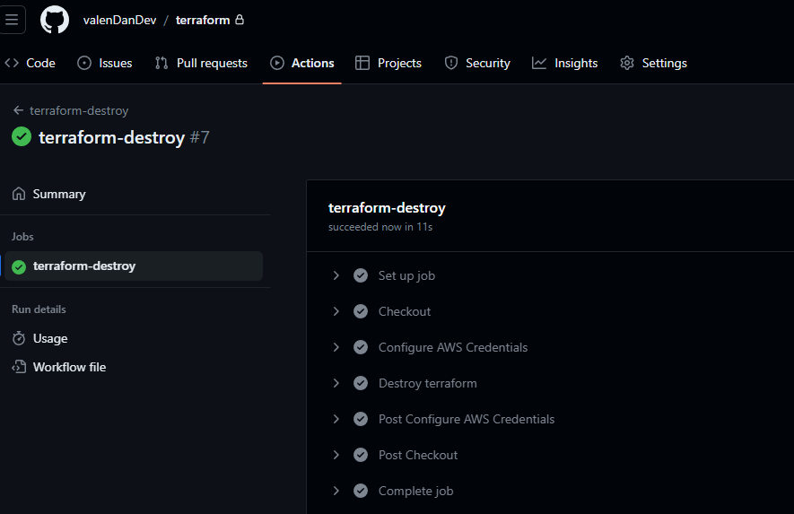
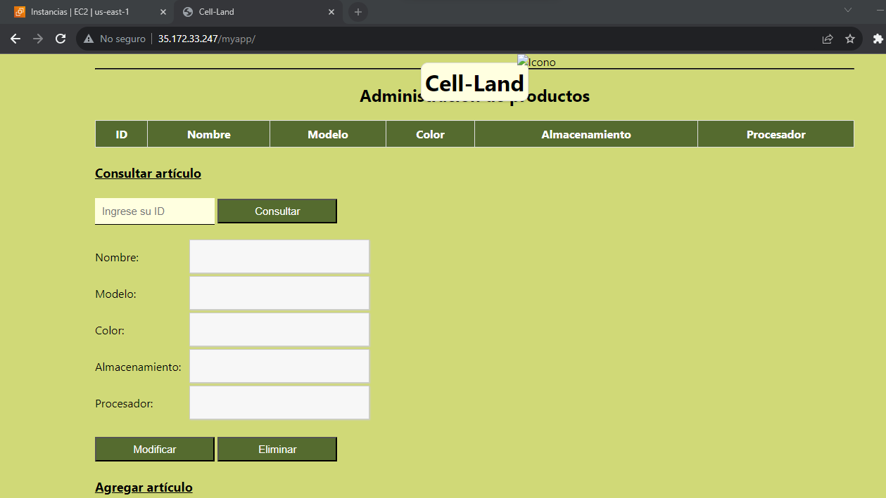

## Entregable terraform

Consideraciones:

* Cambiar la ruta de las credenciales de AWS en **variables.tf** en la línea 12 según el usuario del equipo donde se instalo el Amazon CLI

        10 //archivo local, cambiar según la ubicación
        11 variable "shared_credentials_file" {
        12 default = "/Users/Usuario/.aws/credentials"
        13 }
* Antes de ejecutar este script de Terraform, asegúrese de haber creado la clave (keypair) para la instancia EC2. Cambie la keypair en la línea 44 del archivo **variables.tf** según la creada en EC2.

        42 # KeyPair
        43 variable "aws_keypair" { //la keypair que se crea en EC2
        44 default = "KP-labITM-1"
        45 }

* Modifique la variable public_ip en la línea 121 del archivo **variables.tf**, asignando la dirección IP pública que permitirá el acceso desde todos los puertos a la instancia EC2 provenientes de su estación de trabajo.

        119 ##cambiar la direccion de acuerdo a la ip publica {
        120 variable "public_ip" {
        121 default = "ipPublica/32"
        122 }

* Para activar el flujo de trabajo con GitHub Actions, realice un fork de este repositorio y cree las variables secretas con las credenciales de AWS para su laboratorio. Al realizar un push en el repositorio, se activará el flujo para ejecutar el archivo deploy1.yml.

* El flujo de trabajo del archivo destroy1.yml se habilita de forma manual en GitHub Actions 

 

Esta es la página desplegada en AWS

